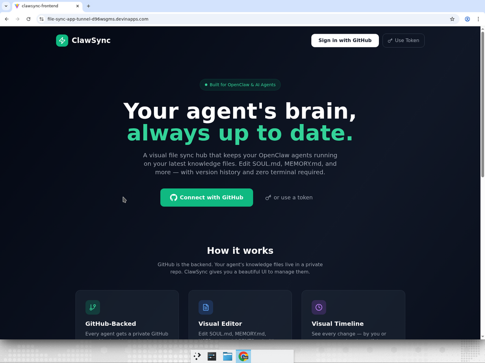
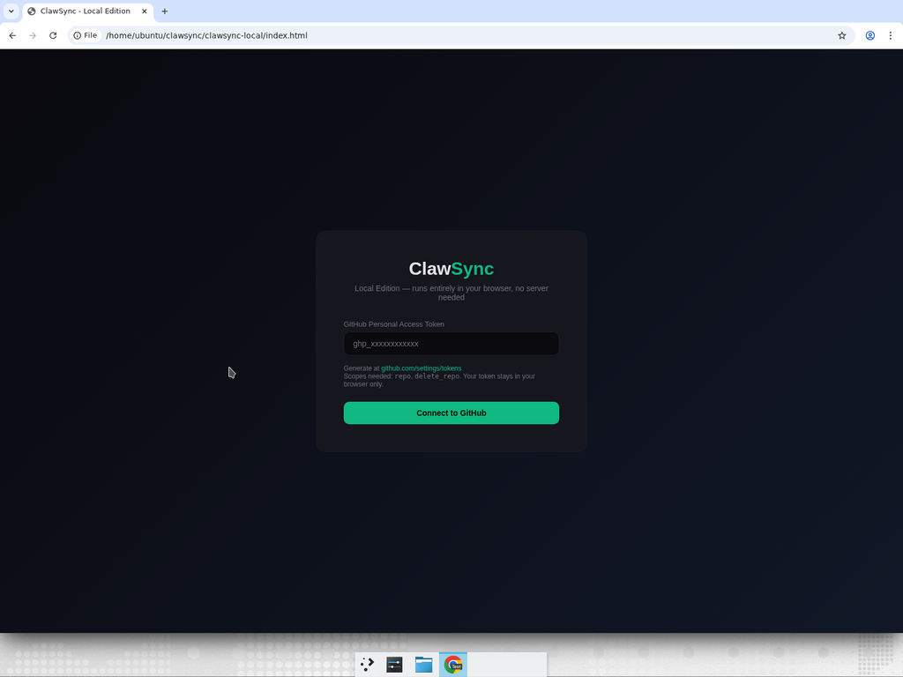

# Pagekeeper

**Your files. Always in sync. From anywhere.**

GitHub is way better than just your local computer — it truly enables you to connect from **anywhere** and using **any tool**. But it can be intimidating for first-timers or non-developers.

That's where Pagekeeper comes in. It helps you make changes how you know best — through a simple, visual interface — and in the background, it keeps everything synced and up to date. No terminal. No git commands. Just edit and go.

Built for [OpenClaw](https://github.com/openclaw) and any AI agent that reads knowledge files from disk (SOUL.md, MEMORY.md, USER.md, AGENTS.md, etc.).

## Screenshots

### Web App — Landing Page


### HTML Local Edition — PAT Login


## Why GitHub as the Backend?

Most people think of GitHub as "developer stuff." But for AI agent files, it's actually the perfect backend:

- **Access from anywhere** — edit from your phone, laptop, tablet, VPS
- **Connect any tool** — VS Code, Obsidian, the GitHub app, or Pagekeeper's visual editor
- **Full version history** — every change is tracked, nothing is ever lost
- **Free and reliable** — no database to manage, no servers to maintain
- **Works offline** — files sync when you're back online

Pagekeeper makes GitHub accessible to everyone. You get all the power without the complexity.

## How It Works

```
You (Browser/App)                       Your Server / Mac
┌──────────────────┐                  ┌──────────────────────┐
│  Pagekeeper UI    │ ── saves to ──> │  GitHub Repository   │
│  - Edit files     │                 │  (source of truth)   │
│  - Visual timeline │                 └──────────┬───────────┘
│  - Branch & merge  │                            │
└──────────────────┘                   git pull (every 60s)
                                                  │
                                       ┌──────────▼───────────┐
                                       │  Your agent workspace │
                                       │  Agent reads files    │
                                       │  from disk            │
                                       └───────────────────────┘
```

**No database.** GitHub is the backend — repos store your agent files, commits are your version history, and the GitHub API handles everything.

## Three Ways to Use Pagekeeper

| Version | Best For | Setup |
|---------|----------|-------|
| **Web App** | Teams, hosted deployment | Deploy frontend + backend |
| **CLI** | Developers, local use | `pip install pagekeeper` |
| **HTML Local** | Anyone, zero setup | Double-click `index.html` |

---

## 1. HTML Local Edition (Simplest)

A single HTML file that runs entirely in your browser. No server, no install, no dependencies.

### Quick Start
1. Download `pagekeeper-local/index.html`
2. Open it in your browser (double-click or drag to browser)
3. Paste a GitHub Personal Access Token ([generate one here](https://github.com/settings/tokens/new?scopes=repo,delete_repo&description=Pagekeeper+Local))
4. Start managing your agent files

### Features
- Dashboard with all your agent repos
- Create agents with 6 templates (Default, Support, Personal, Dev, Sales, Content)
- Open existing repos — auto-discovers all markdown files
- Visual markdown editor with live preview
- Git commit timeline
- Sync checker — test if your VPS/Mac is pulling changes
- Advanced mode — branches, diffs, PR-style merges
- Setup wizard — VPS, Mac, and Local Folder sync instructions
- Delete repos
- Add new files (standard knowledge files + custom)

---

## 2. CLI Edition

A pip-installable package that runs the full Pagekeeper app locally.

### Quick Start
```bash
pip install pagekeeper
pagekeeper
```

On first run, it walks you through GitHub auth setup. After that, it opens `localhost:8000` in your browser with the full app.

### Features
- Everything in the web app
- PAT-based auth (no OAuth needed)
- Saves credentials to `~/.pagekeeper.env`
- Works on Mac, Linux, Windows

### Build from Source
```bash
cd pagekeeper-cli
pip install -e .
pagekeeper
```

---

## 3. Web App Edition

A full React + FastAPI web application for hosted/team deployment.

### Quick Start
```bash
# Backend
cd pagekeeper-backend
poetry install
cp .env.example .env  # Add your GitHub OAuth credentials
poetry run fastapi dev app/main.py --port 8000

# Frontend
cd pagekeeper-frontend
npm install
cp .env.example .env  # Set VITE_API_URL
npm run dev
```

### Features
- GitHub OAuth authentication
- All features from the HTML edition
- Multi-user support
- Deployable to any cloud provider

### Environment Variables

**Backend** (`pagekeeper-backend/.env`):
```
GITHUB_CLIENT_ID=your_client_id
GITHUB_CLIENT_SECRET=your_client_secret
FRONTEND_URL=http://localhost:5173
```

**Frontend** (`pagekeeper-frontend/.env`):
```
VITE_API_URL=http://localhost:8000
```

### GitHub OAuth Setup
1. Go to [GitHub Developer Settings](https://github.com/settings/developers)
2. Click "New OAuth App"
3. Set Homepage URL to your frontend URL
4. Set Authorization callback URL to `{backend_url}/auth/github/callback`
5. Copy Client ID and Client Secret to your `.env`

---

## Desktop App (Electron)

An Electron wrapper for the web app that runs as a native desktop application.

### Pre-built Downloads
- **Mac (x64)**: `Pagekeeper-0.1.0-mac-x64.zip` — unzip and drag to Applications
- **Linux**: `Pagekeeper-0.1.0.AppImage` — make executable and run

### Build from Source
```bash
cd pagekeeper-desktop
npm install
npm run build:linux  # or npm run build:mac on a Mac
```

> **Note**: Building the Mac `.app` requires running on macOS. The Linux AppImage can be built on any Linux system.

---

## Syncing to Your Server / Mac

Pagekeeper edits files on GitHub. To get those changes onto your server or Mac, you set up a simple git-based sync.

### VPS / Server (One-way pull)

```bash
# 1. Clone the repo
git clone git@github.com:YOU/YOUR-AGENT.git ~/.openclaw/workspace

# 2. Set up auto-sync (cron pulls every minute)
(crontab -l 2>/dev/null; echo "* * * * * cd ~/.openclaw/workspace && git pull --quiet") | crontab -
```

### Mac / Laptop (Two-way sync)

```bash
# 1. Clone the repo
git clone git@github.com:YOU/YOUR-AGENT.git ~/Pagekeeper/YOUR-AGENT

# 2. Save this as ~/pagekeeper-sync.sh
#!/bin/bash
while true; do
  cd ~/Pagekeeper/YOUR-AGENT
  git pull --quiet
  git add -A && git diff --cached --quiet || git commit -m "Auto-sync" && git push --quiet
  sleep 60
done

# 3. Make it executable and run
chmod +x ~/pagekeeper-sync.sh
nohup ~/pagekeeper-sync.sh &
```

### Local Folder Sync

Same as Mac sync — pick any folder, clone the repo there, and run the sync script. The setup wizard in Pagekeeper gives you pre-filled commands with your actual repo name.

### Verifying Sync

Use the **Sync Check** feature in Pagekeeper:
1. Click "Sync Check" in the editor sidebar
2. Click "Send Sync Test" — creates a test file in your GitHub repo
3. Wait 1-2 minutes for the cron/sync to pull
4. Run the provided `cat` command on your server to verify

---

## Templates

Pagekeeper comes with 6 full assistant templates:

| Template | Description |
|----------|-------------|
| **Default Agent** | Versatile assistant with smart communication defaults |
| **Support Bot** | CS playbook: escalation flows, triage, response templates |
| **Personal Assistant** | Chief of staff: briefings, task management, daily patterns |
| **Dev Agent** | Senior engineer: code review checklist, git conventions |
| **Sales & Outreach** | Pipeline tracker, cold email templates, follow-up sequences |
| **Content Creator** | Content calendar, platform guidelines, repurpose playbook |

Each template creates 4 files: `SOUL.md`, `MEMORY.md`, `USER.md`, `AGENTS.md` with fill-in-the-blank sections.

---

## Advanced Mode

Toggle "Advanced" in the editor to unlock git-powered version control:

- **Branch picker** — create and switch branches
- **Diff view** — see file-by-file changes with +/- stats
- **Merge UI** — PR-style merge with custom commit messages, auto-deletes branch after merge
- **Branch-aware editing** — edits on non-default branches stay isolated until you merge

This gives you the safety of git branching without ever touching the terminal.

---

## Architecture

```
pagekeeper/
├── pagekeeper-frontend/     # React + Vite frontend (web app)
│   ├── src/
│   │   ├── pages/         # Dashboard, AgentDetail, Timeline, Landing
│   │   ├── lib/           # API client, utilities
│   │   └── components/    # Shared components
│   └── package.json
├── pagekeeper-backend/      # FastAPI backend (GitHub API proxy + OAuth)
│   ├── app/
│   │   └── main.py        # All routes: auth, repos, files, branches
│   └── pyproject.toml
├── pagekeeper-cli/          # Pip-installable CLI package
│   ├── pagekeeper/
│   │   ├── cli.py         # Entry point
│   │   └── server.py      # Embedded FastAPI server
│   └── pyproject.toml
├── pagekeeper-desktop/      # Electron desktop wrapper
│   ├── main.js            # Electron main process
│   ├── server/            # Embedded backend for desktop
│   └── package.json
└── pagekeeper-local/        # Standalone HTML edition
    └── index.html         # Single file, all features
```

## Tech Stack

- **Frontend**: React, TypeScript, Vite
- **Backend**: Python, FastAPI, Poetry
- **Desktop**: Electron
- **Auth**: GitHub OAuth (web) / Personal Access Token (local/CLI)
- **Storage**: GitHub repos (no database)
- **Sync**: Git (cron/script-based pull/push)

## License

MIT
